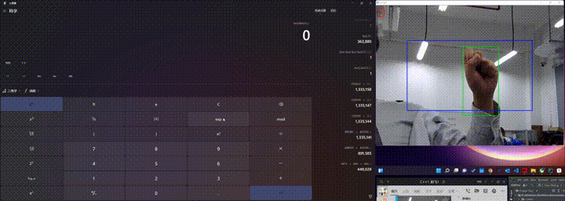

# SUSTech CS205 HCI Project - Gesture Recognition and Remote Control

## Overview
This project is developed as a part of the CS205 C/C++ course, focusing on utilizing OpenCV for hand gesture recognition to perform remote control operations on a computer. The goal is to accurately track hand position, gesture, and movement, and use these inputs to control the computer remotely.

## Team Members
- Wang Haiyu
- Ye Haoteng
- Tang Hongjing

## Objectives
- Use OpenCV to capture real-time images from the webcam.
- Detect the position of the hand in the frame and mark it with a rectangle.
- Track the movement of the hand and its trajectory in the image.
- Recognize shapes drawn by hand movements.
- Control mouse pointer actions through hand movements.
- Perform shape correction after drawing with hand gestures.

## Approach
- **Hand Detection**: Implemented using skin color detection in RGB, HSV, and YCrCb color spaces with Cr channel and OTSU thresholding, the latter providing the best results.
- **Gesture Recognition**: Finger count was detected using two methods:
  - **Method 1**: Fourier descriptors with an SVM classifier using a dataset of 14x6 images.
  - **Method 2**: Convexity defects and hulls to count the spaces between extended fingers, which proved to be the superior and chosen method due to real-time performance requirements.
- **Trajectory Detection**: The hand's pixel center movement was tracked, and polyline approximation was used to recognize the drawn shapes like lines, triangles, quadrilaterals, or circles based on the number of points.
- **Mouse Control**: Utilized Windows pointer control functions to map the hand's position in the image to the mouse pointer's position on the screen. Defined gestures for click and double-click operations.

## Outcomes
- Successfully implemented hand position, gesture, and movement trajectory recognition using C++ and OpenCV.
- Enabled mouse pointer control through hand position.
- Defined specific gestures for mouse operations such as left-click, double-click, and program control.
- Recognized hand movement trajectories and performed shape approximation.

## Challenges and Solutions
- Data type understanding and handling in C++ and OpenCV.
- Selection of color channels and image processing to handle noise and lighting conditions.
- Control of mouse movement and clicks, which was fine-tuned for stability and reliability.
- Parameter adjustments across various functions for optimized performance.

## Highlights
- Effective use of the Cr channel in the YCrCb color space for robust hand detection.
- Extracted and processed information using built-in OpenCV methods, avoiding real-time performance issues associated with machine learning approaches.
- Assigned different numerical hand gestures to represent various functionalities, streamlining pointer actions and program operations.
